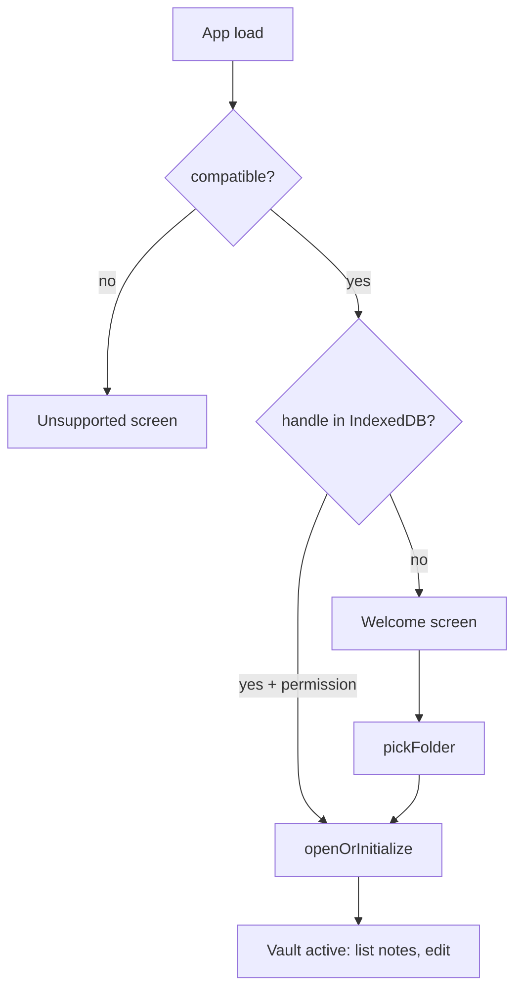

# ADR-001: Local-first vault (File System Access API)

- **Status:** Accepted
- **Date:** 2026-05-19

## Context

- Users want **private notes** they own: plain files, no account, no server reading their content.
- The app must read/write a directory the user chooses on their machine.
- We target **Chromium** browsers where the [File System Access API](https://developer.mozilla.org/en-US/docs/Web/API/File_System_Access_API) is available.

## Decision

1. **No backend.** All I/O goes through `FileSystemDirectoryHandle` on a user-picked folder (`showDirectoryPicker`, mode `readwrite`).
2. **Vault initialization** in `openOrInitialize`: empty folder (ignoring `.DS_Store`) → create layout; valid `manifest.json` → open; otherwise → error.
3. **Permission model:** request `readwrite` in a user gesture right after pick; background work assumes permission is already granted (`ensureReadWritePermission`, `hasReadWritePermission`).
4. **Persist the handle** in IndexedDB (`vault-handle-store`) so refresh/HMR can reopen the same folder without picking again (if permission still holds).
5. **Compatibility gate** in `getCompatibility()`: require FSA, Web Workers, and `SubtleCrypto.digest`; show `Unsupported` otherwise. WebGPU is optional (embedder uses WASM).

### Why IndexedDB for the handle?

The API does not give the app a filesystem path (e.g. `/Users/...`) to save and reopen later. After `showDirectoryPicker`, the browser returns a `FileSystemDirectoryHandle`—permission to that folder, not a string. Only that object can access the vault again; `localStorage` and in-memory state (e.g. React or Zustand) cannot store it across a reload. IndexedDB can persist handles via structured clone, which is the platform-supported way to skip the picker on refresh when permission still holds. We use it only for that one key—not as a general app cache; notes and indexes stay on disk.

## Consequences

### Positive

- Notes are ordinary files — backup, sync, and `grep` work with standard tools.
- Zero trust in a third-party server for note content.

### Negative

- **Chromium-only** until other engines ship FSA.
- Permission can expire; user may need to re-grant or re-pick the folder.
- No built-in multi-user or real-time collaboration.

### Neutral

- `App.tsx` orchestrates vault lifecycle; low-level paths live in `src/lib/fs/`.

## Diagram

## References

- [File System Access API (MDN)](https://developer.mozilla.org/en-US/docs/Web/API/File_System_Access_API)
- [File System Access specification (WHATWG)](https://fs.spec.whatwg.org/)
- [IndexedDB API (MDN)](https://developer.mozilla.org/en-US/docs/Web/API/IndexedDB_API)
- Code: `src/lib/fs/vault.ts`, `picker.ts`, `permissions.ts`, `vault-handle-store.ts`, `src/lib/compatibility.ts`
