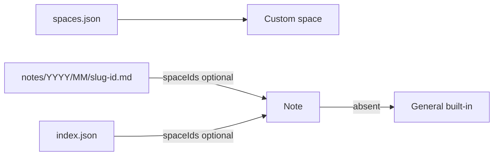

# ADR-002: Plain Markdown notes + JSON index

- **Status:** Accepted
- **Date:** 2026-05-19
- **Updated:** 2026-07-20

## Context

- Notes must remain **portable and human-readable** outside the app.
- We need fast listing and metadata without scanning the whole tree on every UI update.
- Frontmatter should stay simple — no full YAML parser dependency; only flat string fields.
- Users need to group notes into named, colored **spaces** (tags) without leaving the local-first model.

## Decision

1. **Each note is a `.md` file** with a small YAML frontmatter block parsed/serialized manually in `frontmatter.ts`. Required keys: `id`, `title`, `createdAt`, `updatedAt`.
2. **Paths are stable:** `notes/YYYY/MM/<slug>-<id>.md`. Title changes update frontmatter and index only — the file path does not move (`path.ts`).
3. **Central index:** `.private-notes/index.json` holds `NoteRecord[]` for listing; the filesystem is the source of truth for body content.
4. **Vault manifest:** `.private-notes/manifest.json` with app signature `private-notes` and `SCHEMA_VERSION` ([ADR-008](./008-schema-compatibility.md)).
5. **Safe delete:** remove entry from index first, then delete the file; drop attachment refs and garbage-collect orphan blobs ([ADR-006](./006-attachments-cache.md)).
6. **IDs:** opaque string ids (ULIDs) embedded in the filename.

### Spaces

7. **Built-in General space:** id `"general"`, name `"General"`. Notes with no custom spaces belong here; General is never persisted on notes.
8. **Custom spaces:** `.private-notes/spaces.json` holds `{ version, spaces: [{ id, name, colorId, description?, createdAt, updatedAt }] }`. IDs are ULIDs; `colorId` is one of `blue | green | amber | red | purple` (CSS chip tokens in `design-tokens.css`). Timestamps are ISO 8601 strings set on create; `updatedAt` advances on every space edit.
9. **Note assignment:** optional `spaceIds` in frontmatter and index — a **comma-separated** list of custom space ULIDs in one quoted string (keeps the hand-written YAML subset string-only). Because the separator is part of the format, a space id may not contain a comma or whitespace; `spaceId()` enforces this, and unreadable entries are skipped on parse rather than failing the note.
10. **Multi-space:** a note may belong to several custom spaces simultaneously. Empty/missing `spaceIds` means General only.
11. **Delete space:** strip the id from every note's `spaceIds` first, then remove the entry from `spaces.json` (notes fall back toward General when no custom ids remain). The note rewrite is the multi-file half, so doing it first leaves a failure retryable instead of stranding notes that point at an invisible space. The two aggregates are orchestrated by the `delete-space` use-case, never by a repository.
12. **Schema version:** vault schema is **v1** — notes, `spaces.json`, comma-separated `spaceIds`, optional space `description`, and required `createdAt` / `updatedAt` on custom spaces. Future bumps use `migrateVaultIfNeeded` on vault open ([ADR-008](./008-schema-compatibility.md)).

## Consequences

### Positive

- Users can edit notes in any editor; only frontmatter conventions matter.
- Index makes the sidebar O(n) over records, not O(files) walks.
- Spaces are vault-local, portable, and human-readable in frontmatter.

### Negative

- Index and files can theoretically diverge if edited externally without updating `index.json`.
- Deleting a space rewrites every affected note's frontmatter.
- External editors can set unknown space ids. The UI renders the raw id on a neutral chip until the user reassigns — deliberately *not* labelled "General", so a dangling reference stays visible instead of hiding behind a valid-looking name.

### Neutral

- Markdown body excludes frontmatter; semantic indexing hashes the body only.
- Chip colors stay in CSS tokens — only color ids are persisted.

## Diagram

## References

- [ADR-008](./008-schema-compatibility.md) — schema versioning policy
- [CommonMark](https://commonmark.org/)
- [YAML specification](https://yaml.org/spec/) (we only use a constrained subset by hand)
- Code: `src/infrastructure/notes/`, `src/infrastructure/spaces/`, `src/domain/note/frontmatter.ts`, `src/infrastructure/fs/schema.ts`
