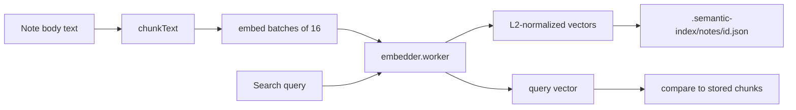

# ADR-003: On-device semantic search (embeddings, not LLM)

- **Status:** Accepted
- **Date:** 2026-05-19

## Context

- Users need to find notes by **meaning**, not only exact keywords.
- Sending all notes to a remote API breaks the privacy model ([ADR-001](./001-local-first-vault.md)).
- A **generative LLM** (e.g. WebLLM) is the wrong primitive for indexing: it does not build a reusable index and does not scale across thousands of notes. **Embeddings + vector similarity** are the standard approach for “search my corpus.”

## Decision

1. **Embedding model:** default `Xenova/paraphrase-multilingual-MiniLM-L12-v2` (~384 dimensions, ~120 MB quantized), running in a **dedicated Web Worker** via [`@huggingface/transformers`](https://github.com/huggingface/transformers.js) (`embedder.worker.ts`).
2. **`Embedder` interface** (`embedder.ts`): `embed(texts) → number[][]` returns **L2-normalized** vectors; production uses `TransformersEmbedder`, tests use `FakeEmbedder`.
3. **Inference device:** WASM (`device: "wasm"`). WebGPU is detected in compatibility but not required.
4. **Chunking:** word-based, ~200 words per chunk, ~32 words overlap (`chunk.ts`) — synchronous, no tokenizer in the chunker.
5. **Lazy loading:** search API and worker start after the vault opens (`runtime.ts`, `App.tsx`) to keep the initial bundle small.
6. **First run:** model weights download from the Hugging Face CDN and cache in the browser; later runs are offline.

## Consequences

### Positive

- Semantic search works without accounts or API keys.
- Multilingual model fits mixed-language personal notes.

### Negative

- First search incurs a large download and CPU cost to index.
- WASM inference is slower than native; acceptable for personal vault sizes.

### Neutral

- A future LLM layer could **answer** using retrieved chunks; it is not required for search itself.

## Diagram

## References

- [transformers.js documentation](https://huggingface.co/docs/transformers.js)
- [Model card: paraphrase-multilingual-MiniLM-L12-v2 (Xenova)](https://huggingface.co/Xenova/paraphrase-multilingual-MiniLM-L12-v2)
- [Getting started with embeddings (Hugging Face)](https://huggingface.co/blog/getting-started-with-embeddings)
- [Web Workers API (MDN)](https://developer.mozilla.org/en-US/docs/Web/API/Web_Workers_API)
- Code: `src/lib/search/embedder.ts`, `transformers-embedder.ts`, `chunk.ts`, `src/workers/embedder.worker.ts`, `runtime.ts`
