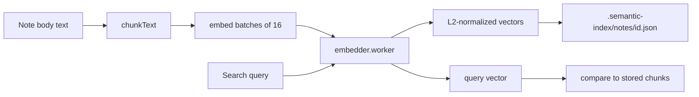

# ADR-003: On-device semantic search (embeddings, not LLM)

- **Status:** Accepted
- **Date:** 2026-05-19
- **Updated:** 2026-07-21

## Context

- Users need to find notes by **meaning**, not only exact keywords.
- Sending all notes to a remote API breaks the privacy model ([ADR-001](./001-local-first-vault.md)).
- A **generative LLM** (e.g. WebLLM) is the wrong primitive for indexing: it does not build a reusable index and does not scale across thousands of notes. **Embeddings + vector similarity** are the standard approach for “search my corpus.”

## Decision

1. **Embedding model:** `Xenova/multilingual-e5-small` — 384 dimensions, ~120 MB
   quantized, Spanish and English both first-class, running in a **dedicated Web
   Worker** via [`@huggingface/transformers`](https://github.com/huggingface/transformers.js)
   (`embedder.worker.ts`). E5-style models are trained for **asymmetric
   retrieval** — a short query against a long passage — using `query: ` and
   `passage: ` instruction prefixes. Paraphrase models answer a different
   question ("do these two sentences mean the same thing?") and degrade on our
   query shape. Omitting E5 prefixes measurably hurts accuracy; sending them to
   a symmetric model hurts that one. The convention belongs to the model, not
   the call site.
2. **`Embedder` interface** (`embedder.ts`): `embed(texts) → number[][]` returns
   **L2-normalized** vectors; production uses `TransformersEmbedder`, tests use
   `FakeEmbedder`. The interface also carries model-specific conventions:
   optional `prefixes: { query, passage }` and optional `minScore` floor.
   `toQueryInput` / `toPassageInput` in `infrastructure/search/embedder.ts`
   apply prefixes; the indexer embeds passages, `searchSemantic` embeds queries.
   `TransformersEmbedder` takes a `ModelProfile` (`{ id, prefixes, minScore }`)
   instead of a bare model id. Default floor: `minScore: 0.75` — E5 compresses
   unrelated pairs into roughly 0.72–0.80 and good ones into 0.85+; the
   floor-relative cutoff in [ADR-010](./010-hybrid-relevance.md) does the
   discriminating work. The interface keeps `indexer.ts` / `search.ts` free of
   worker and transformers.js imports.
3. **Three embed layers:** `Embedder` (contract + test fake) → `TransformersEmbedder` (main-thread worker client) → `embedder.worker.ts` (inference only). Chunking, vault I/O, and dot-product scoring stay on the main thread; only model inference runs in the worker.
4. **Inference device:** WASM (`device: "wasm"`). WebGPU is detected in compatibility but not required.
5. **Chunking:** word-based, synchronous, no tokenizer in the chunker (`chunk.ts`). Sizes and the title vector are covered by [ADR-010](./010-hybrid-relevance.md).
6. **Lazy loading:** search API and worker start after the vault opens (`runtime.ts`, `App.tsx`) to keep the initial bundle small.
7. **First run:** model weights download from the Hugging Face CDN and cache in the browser; later runs are offline.

## Consequences

### Positive

- Semantic search works without accounts or API keys.
- Multilingual model fits mixed-language personal notes.

### Negative

- First search incurs a large download and CPU cost to index.
- WASM inference is slower than native; acceptable for personal vault sizes.
- `minScore: 0.75` is reasoned from E5's known score distribution, not measured
  in a browser against the fixture corpus; if set too high the dense side goes
  quiet and results degrade to lexical-only rather than to nothing.

### Neutral

- A future LLM layer could **answer** using retrieved chunks; it is not required for search itself.
- The model id is part of the semantic manifest, so a model swap drops the index
  and re-embeds ([ADR-004](./004-semantic-index-persistence.md),
  [ADR-008](./008-schema-compatibility.md)).

## Diagram

```mermaid
flowchart LR
  NoteBody[Note body text] --> Chunk[chunkText]
  Chunk --> Batch[embed batches of 16]
  Batch --> Worker[embedder.worker]
  Worker --> Vectors[L2-normalized vectors]
  Vectors --> Disk[".semantic-index/notes/id.json"]

  Query[Search query] --> Worker
  Worker --> QVec[query vector]
  QVec --> Score[compare to stored chunks]
```

## References

- Deep dive (optional): [semantic-search-primer.md](../semantic-search-primer.md)
- [transformers.js documentation](https://huggingface.co/docs/transformers.js)
- [ADR-010](./010-hybrid-relevance.md) — title indexing, lexical fusion, ranking
- [Model card: multilingual-e5-small (Xenova)](https://huggingface.co/Xenova/multilingual-e5-small)
- [Text Embeddings by Weakly-Supervised Contrastive Pre-training (E5)](https://arxiv.org/abs/2212.03533)
- [Getting started with embeddings (Hugging Face)](https://huggingface.co/blog/getting-started-with-embeddings)
- [Web Workers API (MDN)](https://developer.mozilla.org/en-US/docs/Web/API/Web_Workers_API)
- Code: `src/lib/search/embedder.ts`, `transformers-embedder.ts`, `chunk.ts`, `src/workers/embedder.worker.ts`, `runtime.ts`
