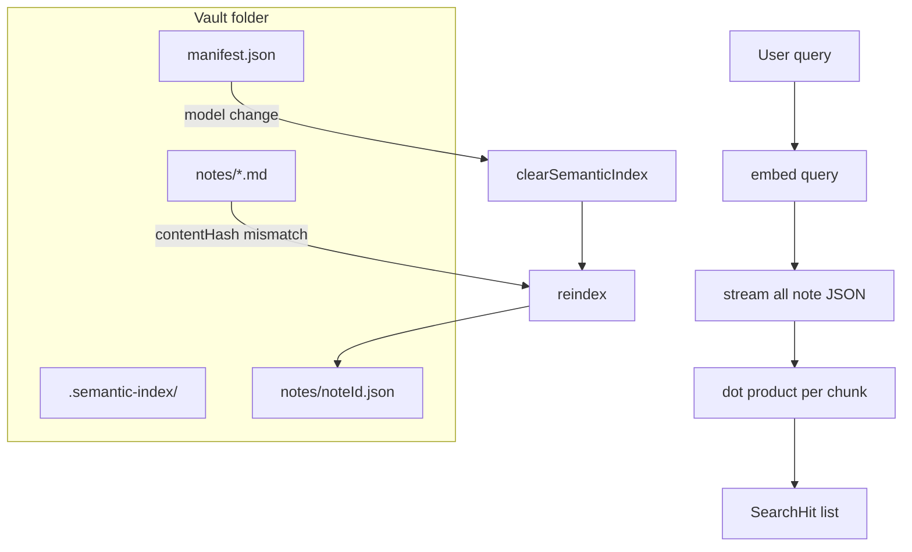

# ADR-004: Semantic index layout, sync, and search execution

- **Status:** Accepted
- **Date:** 2026-05-19

## Context

- Embeddings must persist across sessions and optionally **sync across devices** (Dropbox, iCloud, etc.) without rewriting Markdown notes.
- Personal vaults are small enough that a full **approximate nearest neighbor (ANN)** database is unnecessary complexity.
- Mixing vectors from different models produces meaningless similarity scores.

## Decision

### On-disk layout

1. Store the index in a **sibling folder** `.semantic-index/` (not inside `.private-notes/`) so sync tools can copy it independently ([`search/types.ts`](../../src/lib/search/types.ts)).
2. **One JSON file per note:** `.semantic-index/notes/<noteId>.json` — narrow sync conflicts (two devices editing different notes never write the same file).
3. **Manifest** at `.semantic-index/manifest.json`: `{ schemaVersion, modelId, dimensions }`.

Each per-note file stores `contentHash` (SHA-1 of body), chunk text + embeddings, and metadata. See [architecture.md](../architecture.md) for the flow; user-facing JSON example stays in the [README](../../README.md).

### Invalidation & reindex

| Check | Action |
|-------|--------|
| Missing file | Index note |
| `contentHash` changed | Re-embed note |
| `schemaVersion` / `modelId` / `dimensions` mismatch | Re-embed or wipe entire index if manifest model changed |
| Note deleted | `pruneOrphans` removes stale JSON |

`pruneOrphans` is separate from `reindex` and called before full reindex and after delete.

### Search algorithm

1. Embed the query once.
2. **Stream** per-note JSON files (`iterateNoteEmbeddings`) — do not load the whole vault into RAM.
3. Skip records whose `modelId` or `dimensions` do not match the active embedder.
4. **Cosine similarity** = dot product (vectors are unit-normalized in [`embedder.ts`](../../src/lib/search/embedder.ts)).
5. Keep top chunks per note (cap ~3), then global top-K (default 8), filter by `minScore`.

**No vector database, no ANN** — linear scan is acceptable for personal note counts.

## Consequences

### Positive

- Sync-friendly layout; re-indexing is incremental by content hash.
- Strict model isolation avoids silent bad rankings.

### Negative

- Search cost grows linearly with total chunks.
- Large embedding JSON files increase sync bandwidth.

### Neutral

- Empty notes get `chunks: []` so the indexer does not retry forever.

## Diagram

## References

- Deep dive (optional): [semantic-search-primer.md](../semantic-search-primer.md)
- [Cosine similarity (Wikipedia)](https://en.wikipedia.org/wiki/Cosine_similarity)
- [SubtleCrypto.digest (MDN)](https://developer.mozilla.org/en-US/docs/Web/API/SubtleCrypto/digest) — used for `contentHash`
- Related: [ADR-003](./003-semantic-search-embeddings.md), [ADR-007](./007-autosave-eventual-reindex.md), [ADR-008](./008-schema-compatibility.md)
- Code: `src/lib/search/indexer.ts`, `index-fs.ts`, `search.ts`, `src/lib/attachments/hash.ts` (`sha1Hex`)
