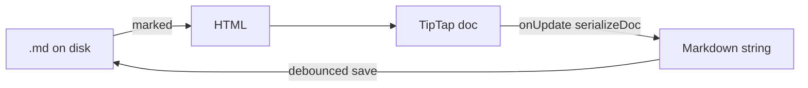

# ADR-005: TipTap editor with constrained Markdown round-trip

- **Status:** Accepted
- **Date:** 2026-05-19
- **Updated:** 2026-07-17

## Context

- **Source of truth on disk** is Markdown ([ADR-002](./002-note-storage-format.md)).
- Users expect a **rich editing** experience (bold, italic, images), not a raw textarea.
- A full CommonMark ↔ ProseMirror bijection is large; we only need the subset we persist today.

## Decision

1. **TipTap** (ProseMirror) in the UI; **Markdown on disk** — convert on load and save via custom `markdownToHtml` / `serializeDoc`.
2. **Parsing:** [marked](https://marked.js.org/) for MD → HTML; custom post-processing (e.g. unwrap `<p></p>` for block images) in `parse.ts`.
3. **Serialization:** walk ProseMirror JSON in `serialize.ts` — not a generic HTML → MD pipeline.
4. **Supported block nodes** (round-trip via marked + `serializeDoc`):

   | Node | Markdown | Notes |
   | --- | --- | --- |
   | paragraph | plain text | inline marks below |
   | heading (H1–H5) | `#` … `#####` | toolbar style select (Paragraph + Heading 1–5) |
   | bulletList | `- item` | nested lists indented 2 spaces |
   | orderedList | `1. item` | sequential numbering |
   | blockquote | `> line` | blank lines become `>` |
   | codeBlock | ` ``` ` fences | custom `FencedCodeBlock` (``` input rule) |
   | horizontalRule | `---` | toolbar insert; also `---` / `***` input rules |
   | attachmentImage | `` | custom atom node |

5. **Supported inline marks:** bold, italic, strike, underline (`<u>` HTML).
6. **Note switch:** `Editor` remounts with `key={noteId}`; an effect avoids resetting the doc while the user types if serialized markdown still matches `value`.
7. **Images:** custom `AttachmentImage` node (block-level, atom) resolves `src` via blob URLs from [ADR-006](./006-attachments-cache.md); upload goes through `storeAttachment`.

## Consequences

### Positive

- Familiar editing UX while keeping portable `.md` files.
- Headings, lists, blockquotes, and code blocks survive save/reload without silent loss.
- Controlled feature set avoids unsupported nodes appearing without a serializer path.

### Negative

- Notes edited outside the app may use Markdown features we still do not round-trip (H6+, task lists, tables).
- Underline is stored as inline HTML `<u>`, not standard CommonMark.
- List items with multiple paragraphs serialize with a GFM-style 4-space continuation indent; exotic nesting may differ slightly from external editors.

### Neutral

- Editor is `React.lazy`-loaded from `App.tsx`.

## Diagram



## References

- [TipTap documentation](https://tiptap.dev/)
- [ProseMirror guide](https://prosemirror.net/docs/guide/)
- [marked](https://marked.js.org/)
- Code: `src/editor/Editor.tsx`, `TextStyleSelect.tsx`, `extensions/AttachmentImage.ts`, `extensions/FencedCodeBlock.ts`, `src/lib/markdown/parse.ts`, `serialize.ts`
