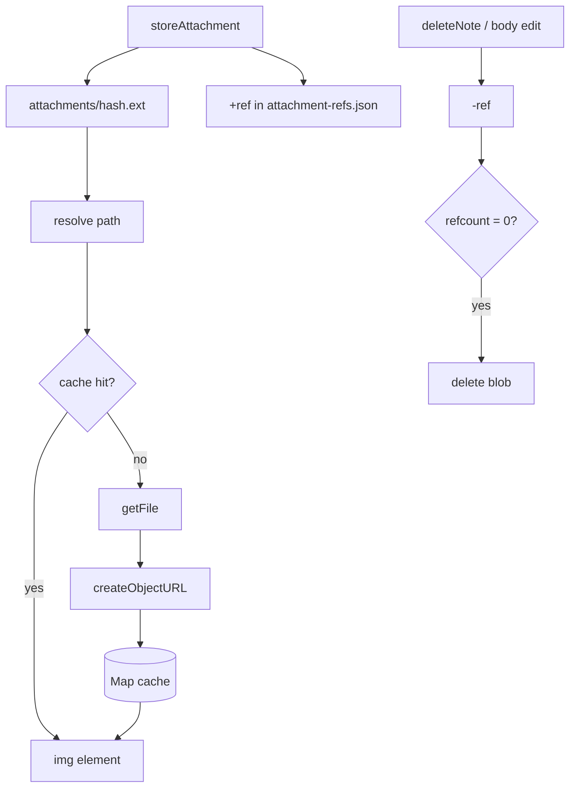

# ADR-006: Content-addressed attachments and blob URL cache

- **Status:** Accepted
- **Date:** 2026-05-19
- **Updated:** 2026-07-17

## Context

- Images in notes are stored as files under `attachments/` ([ADR-002](./002-note-storage-format.md)).
- The File System Access API does **not** expose `file://` or `https://` URLs that `` can load directly.
- Reading the same attachment repeatedly should not hit disk every render.
- The same image may appear in multiple notes; storing one copy per note wastes disk space.

## Decision

1. **Path layout:** `attachments/<sha256>.<ext>` where SHA-256 is computed over file bytes (`hash.ts`, `SubtleCrypto`). Global, flat — no per-note subfolders. SHA-256 replaces an earlier SHA-1 sketch: content-addressed paths require collision resistance, and SHA-1 has practical collision attacks.
2. **Content-addressed storage:** `storeAttachment` writes only if the file does not already exist (global dedup across notes).
3. **Reference index:** `.private-notes/attachment-refs.json` maps each attachment path to the note ids that reference it. Updated on upload, body edit, duplicate, and delete. Markdown remains the source of truth; the index is a performance aid maintained by the app. Reconciliation from a full vault scan is **future work** (not required pre-production).
4. **Garbage collection:** when a path's ref list becomes empty, delete the blob from `attachments/`.
5. **`AttachmentURLCache`** per vault:
   - `Map<relativePath, blobUrl>` for hits.
   - `inflight` map deduplicates concurrent reads of the same path.
   - `dispose()` revokes all blob URLs when the vault closes or changes.
   - `invalidate(path)` revokes a single cached blob after GC deletes the file on disk (`App.tsx`).
6. **Editor integration:** Markdown stores the relative path; `AttachmentImage` calls `resolveSrc` → cache → `URL.createObjectURL`.

`SCHEMA_VERSION` stays at `1` — attachment layout and refs are governed by this ADR, not the vault manifest schema.

## Consequences

### Positive

- Identical bytes share one file on disk across all notes.
- Orphan blobs are removed when the last referencing note is deleted or the image is removed from the body.
- Images render with normal `` tags via blob URLs.

### Negative

- Blob URLs must be revoked to avoid memory leaks — lifecycle tied to vault in `App.tsx`.
- External file edits may show stale blobs until remount (no change watcher yet).
- Ref index can drift if notes are edited outside the app (reconciliation deferred).

### Neutral

- Duplicating a note shares attachment paths and increments refs; no blob copy.

## Diagram

## References

- [URL.createObjectURL (MDN)](https://developer.mozilla.org/en-US/docs/Web/API/URL/createObjectURL_static)
- [File System Access API (MDN)](https://developer.mozilla.org/en-US/docs/Web/API/File_System_Access_API)
- Code: `src/lib/attachments/cache.ts`, `storage.ts`, `refs.ts`, `gc.ts`, `paths.ts`, `hash.ts`
