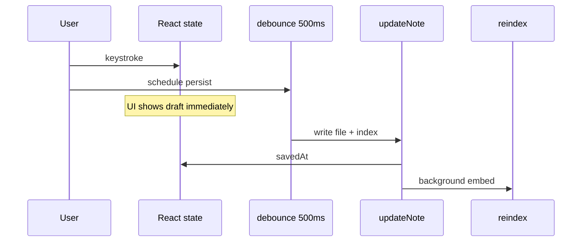

# ADR-007: Optimistic UI, debounced save, eventual reindex

- **Status:** Accepted
- **Date:** 2026-05-19

## Context

- Typing must feel **instant**; writing to disk on every keystroke would be slow and wear sync folders.
- Semantic search should stay **roughly up to date** without blocking the editor during embedding.
- There is no separate “Save” button — persistence is automatic.

## Decision

1. **Optimistic UI:** `onTitleChange` / `onBodyChange` update React state (`current.title`, `current.body`) immediately.
2. **Debounced persist:** `useDebouncedCallback` with **500 ms** delay calls `updateNote` on disk, then updates `savedAt` and refreshes the note list.
3. **Eventual reindex:** after a successful `updateNote`, `reindex(vault, [thatNote])` runs in the background; errors are swallowed so search never blocks editing.
4. **Full reindex** when the vault opens and the embedder is ready: `pruneOrphans` + `reindex` all notes. Progress appears under the sidebar search trigger (`IndexStatus`) as a percentage; when complete, **All indexed** opens an `ActionDialog` for a short explanation and optional manual reindex.
5. **On delete:** update index/files, then `pruneOrphans` for embedding files.
6. **Flush on exit:** `useDebouncedCallback` exposes `flush()`. The app flushes the pending write on `visibilitychange → hidden` and `pagehide` (tab close / reload) and before switching notes or vaults, so the last edit inside the 500 ms window is never lost.
7. **Crash recovery:** because the note file and `index.json` are written in two non-atomic steps, `reconcileVault` runs on every vault open and rebuilds the index from the note files actually on disk — re-adding orphan files, pruning dangling entries, and rebuilding a torn/corrupt index. Note files are the source of truth; the index is a derivable cache.
8. **Multi-tab safety:** every `index.json` read-modify-write runs inside an origin-wide Web Lock (`navigator.locks`, `src/lib/fs/locks.ts`). Two tabs on the same vault serialize instead of last-write-wins clobbering; the index is re-read *inside* the lock so only the fields a mutation touches are overwritten. Falls back to a plain call where the API is unavailable.

This is **not** a transactional sync engine — it is “memory first, disk soon, index later,” with flush-on-exit, open-time reconciliation, and cross-tab locking to bound the loss/corruption windows.

## Consequences

### Positive

- Responsive editor; disk and index catch up without user action.
- Incremental reindex limits embedding work to changed notes.

### Negative

- **No “unsaved” / “saving” indicator** — only “Saved HH:MM:SS” after disk write succeeds.
- **Flush is best-effort:** the flush on exit *initiates* the async File System write; a hard kill before it lands can still lose the tail. Reconciliation recovers the file if it was written, but not an edit that never reached disk.
- **Stale closure risk:** title and body debounce handlers pass the other field from the render that scheduled them; rapid edits to both within 500 ms could write an inconsistent pair.
- **Concurrent same-note edits:** the Web Lock serializes `index.json`, but two tabs editing the *same* note's body still last-write-wins on the Markdown file — the index stays consistent, the note content does not.

### Neutral

- Reindex failures do not roll back the saved Markdown file.

## Diagram

## References

- Related: [ADR-004](./004-semantic-index-persistence.md)
- Code: `src/App.tsx`, `src/lib/useDebouncedCallback.ts`, `src/lib/notes/storage.ts`, `src/lib/notes/reconcile.ts`, `src/lib/fs/locks.ts`, `src/lib/fs/handle.ts` (`listFilesRecursive`), `src/screens/NoteHeader.tsx`, `src/screens/SidebarSearch.tsx`, `src/screens/IndexStatus.tsx`, `src/ui/ActionDialog.tsx`, `src/lib/search/index-progress.ts`
