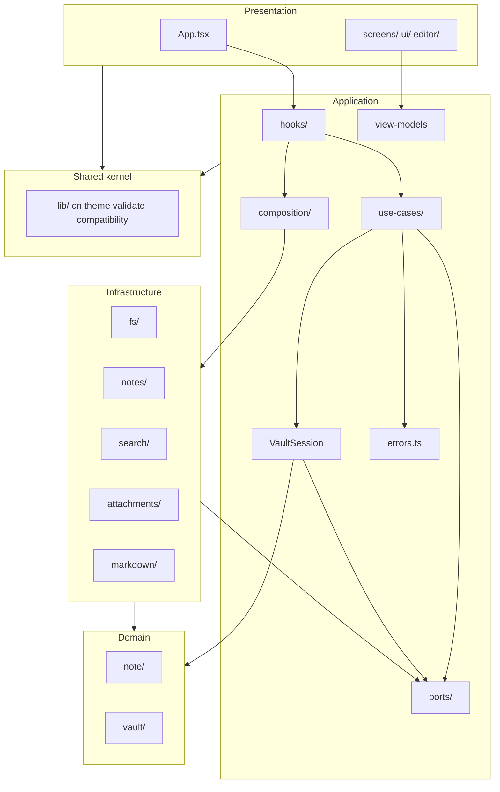

# ADR-009: Layered application architecture (DDD)

- **Status:** Accepted
- **Date:** 2026-07-17

## Context

[`src/App.tsx`](../../src/App.tsx) had grown into a god component: vault boot, embedder lifecycle, note CRUD, autosave, attachment cache, and search orchestration lived in one file with cross-cutting refs. Screens were mostly presentational but imported persistence types (`NoteRecord`, `SearchHit`) from `src/lib/`.

The initial ADR-009 iteration (phases 0–5) introduced domain, ports, `VaultSession`, hooks, and view models while keeping I/O in `src/lib/` behind thin infrastructure adapters. Phases 6–10 complete the migration: all vault I/O lives under `src/infrastructure/`, domain rules are extracted from persistence code, application logic is expressed as explicit use cases, errors are classified, and ESLint enforces layer boundaries.

## Decision

Introduce four source layers alongside the existing UI folders:

| Layer | Path | Rules |
|-------|------|--------|
| Domain | `src/domain/` | Pure TypeScript. Entities, value objects, aggregate helpers, note frontmatter/slug, reconcile policy, welcome-note seed content. No React, no browser I/O APIs. |
| Application | `src/application/` | Ports, use cases, `VaultSession`, view models, errors, hooks. May import domain and shared `lib/` utilities (`useDebouncedCallback`, etc.). Infrastructure only via `application/composition/`. |
| Infrastructure | `src/infrastructure/` | All vault I/O: FSA, IndexedDB handle store, note storage, attachments, semantic index, markdown parse/serialize. Implements application ports. |
| Presentation | `src/ui/`, `src/screens/`, `src/editor/`, `src/App.tsx` | UI only. Screens consume **view models** from application, not persistence types. |
| Shared kernel | `src/lib/` | Cross-cutting utilities without business concepts: `cn`, `theme`, `platform`, `compatibility`, generic `validate`, `useDebouncedCallback`. |

### Domain model

- **Entity `Note`:** id, title, body, path, timestamps — independent of JSON layout.
- **VO `NoteId`:** branded string to avoid id/path confusion.
- **VO `NoteSummary`:** list projection `{ id, title, updatedAt }`.
- **Aggregate helper `Vault`:** pure functions over summaries (sort by recency, pick startup candidate).
- **`domain/note/frontmatter.ts`, `slug.ts`:** on-disk note format and identity rules (no I/O).
- **`domain/vault/reconcile-policy.ts`:** pure reconcile diff/dedupe over index records.
- **`domain/vault/welcome-note.ts`:** seed content for empty vaults.

Persistence DTOs (`NoteRecord`, `NoteIndex`, `PATHS`, `SCHEMA_VERSION`) live in `infrastructure/fs/schema.ts`. Mappers in `infrastructure/notes/note-mappers.ts` convert between schema records and domain entities.

### Ports (application boundary)

| Port | Infrastructure adapter |
|------|------------------------|
| `NoteRepository` | `FsNoteRepository` |
| `VaultGateway` | `FsVaultGateway` |
| `VaultHandleStore` | `IdbVaultHandleStore` |
| `FolderPicker` | `BrowserFolderPicker` |
| `AttachmentStore` | `FsAttachmentStore` |
| `SemanticSearch` | `FsSemanticSearch` |
| `Embedder` | `TransformersEmbedder` (worker) / `FakeEmbedder` (tests) |

Application-facing DTOs at the port boundary: `NoteRecord`, `SearchHit` in `application/ports/`.

### Use cases (`application/use-cases/`)

| Use case | Responsibility |
|----------|----------------|
| `open-vault.ts` | pick + activate + reconcile + startup |
| `close-vault.ts` | dispose attachment cache |
| `resolve-startup.ts` | welcome note or most recent note |
| `open-note.ts` | load note into editor state |
| `create-note.ts` | new note |
| `save-note.ts` | persist edits + attachment invalidation |
| `delete-note.ts` | remove note |
| `duplicate-note.ts` | clone note |
| `autosave-note.ts` | immediate persist + optional reindex schedule |
| `run-full-reindex.ts` | full/incremental semantic reindex |
| `search-notes.ts` | semantic query |

`VaultSession` remains a session-scoped facade holding open vault state; hooks and use cases call into it. `activateVaultSession` is a deprecated alias of `openVault`.

### Application hooks

- `useVaultSession` — boot, folder pick, `openVault`, note list state.
- `useCurrentNote` — open/switch note, optimistic edits; delegates autosave to `useAutosave`.
- `useAutosave` — debounced persist (500 ms) + flush on tab hide / note switch ([ADR-007](./007-autosave-eventual-reindex.md)).
- `useSemanticIndex` — embedder via `composition/load-embedder`, reindex, semantic query.
- `useAttachments` — image upload and blob URL resolution.

`App.tsx` is the composition root: hooks + JSX only.

### Composition (`application/composition/`)

The **only** place hooks may reach concrete infrastructure:

- `defaultInfrastructure` — vault gateway, handle store, folder picker, semantic search factory.
- `createNoteRepository`, `createAttachmentStore`, `createSemanticSearch`.
- `loadDefaultEmbedder` — lazy worker embedder.

### Error policy (`application/errors.ts`)

| Class | `kind` | Surface |
|-------|--------|---------|
| `VaultError` | `user` \| `background` | base |
| `NoteIOError` | `user` | toast (`ui/Toast`) + consola técnica |
| `BackgroundTaskError` | `background` | `console.error` estructurado + IndexStatus (reindex) |

Background reindex failures use `registerBackgroundError("reindex", err)` instead of silent `.catch(() => {})`. User-facing note I/O errors surface via `ui/Toast` (through `useAppToast` + `reportUserError`); technical details log to the console with operation, module, trace, and fix hints.

### Import rules (enforced in ESLint)

```
domain          → domain only
application     → domain, application; infrastructure only via application/composition/
infrastructure  → domain, application/ports, lib/
screens/ui      → ui, application/view-models, lib/cn, lib/platform
App.tsx         → application/hooks, screens, ui, lib/compatibility
editor          → infrastructure/markdown (format adapter); no domain/application
```

`no-restricted-imports` blocks cross-layer violations in CI (`eslint.config.js`).

### What moved out of `src/lib/` (phase 6)

| Former path | New path |
|-------------|----------|
| `lib/fs/` | `infrastructure/fs/` (+ `schema.ts`) |
| `lib/notes/` (I/O) | `infrastructure/notes/` |
| `lib/attachments/` | `infrastructure/attachments/` |
| `lib/search/` | `infrastructure/search/` |
| `lib/markdown/` | `infrastructure/markdown/` |

`src/lib/` retains only the shared kernel listed above.

## Consequences

### Positive

- Screens decoupled from persistence DTOs; reusable with view models.
- External systems hidden behind ports — swappable in tests via `fakeFs` and port mocks.
- Use cases testable without `render(<App />)`.
- Domain rules (frontmatter, reconcile policy) unit-testable without a DOM.
- ESLint catches accidental layer violations.

### Negative

- Two `NoteRecord` shapes exist at the boundary (port DTO vs infra schema) — structurally identical; infra mappers bridge domain entities.
- `activateVaultSession` kept as deprecated alias until callers migrate.

### Neutral

- `NoteIO` removed; `NoteRepository` is the sole note persistence port.
- Index status formatting moved to `application/view-models.ts` (no infra import from screens).

## Diagram (final)



## References

- Supersedes the layer diagram in AGENTS.md §5.1 for orchestration (hooks + thin App).
- Related: [ADR-007](./007-autosave-eventual-reindex.md), [architecture.md](../architecture.md)
- Code: `src/domain/`, `src/application/`, `src/infrastructure/`, `src/App.tsx`
