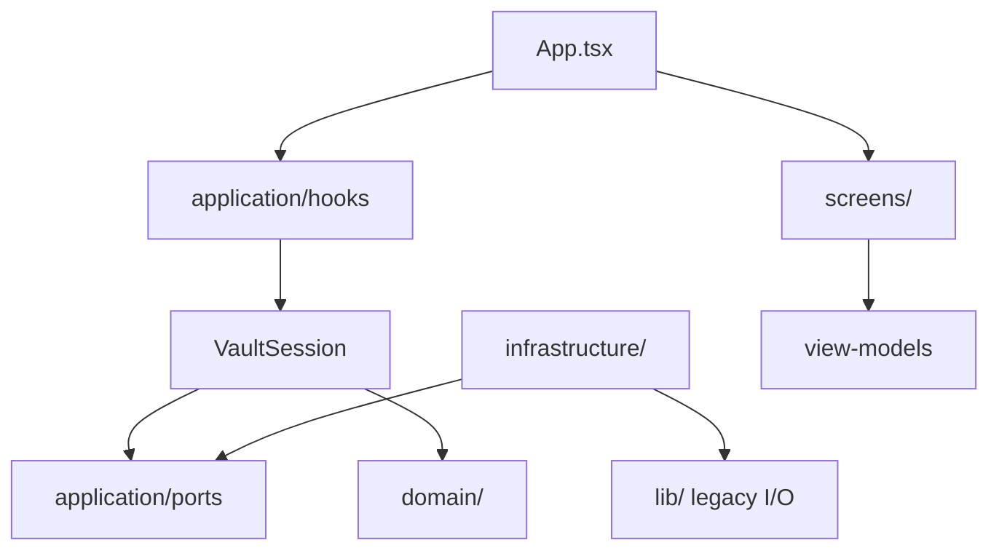

# ADR-009: Layered application architecture (DDD)

- **Status:** Accepted
- **Date:** 2026-07-17

## Context

[`src/App.tsx`](../../src/App.tsx) had grown into a god component: vault boot, embedder lifecycle, note CRUD, autosave, attachment cache, and search orchestration lived in one file with cross-cutting refs. Screens were mostly presentational but imported persistence types (`NoteRecord`, `SearchHit`) from `src/lib/`.

The codebase already had port-like abstractions (`Embedder`, lazy `SearchApi`) and a `{ root, now?, newId? }` bundle in `storage.ts`, but no explicit layer boundaries or domain model separate from on-disk DTOs.

## Decision

Introduce four source layers alongside the existing UI folders:

| Layer | Path | Rules |
|-------|------|--------|
| Domain | `src/domain/` | Pure TypeScript. Entities, value objects, aggregate helpers. No React, no browser I/O APIs. |
| Application | `src/application/` | Ports (interfaces), `VaultSession`, view models, React hooks. May import domain; must not import infrastructure directly from hooks (composition module wires defaults). |
| Infrastructure | `src/infrastructure/` | Adapters implementing application ports by delegating to existing `src/lib/` modules during the incremental migration. |
| Presentation | `src/ui/`, `src/screens/`, `src/editor/`, `src/App.tsx` | UI only. Screens consume **view models** from application, not persistence types from `lib/`. |

### Domain model (minimal)

- **Entity `Note`:** id, title, body, path, timestamps — independent of JSON layout.
- **VO `NoteId`:** branded string to avoid id/path confusion.
- **VO `NoteSummary`:** list projection `{ id, title, updatedAt }`.
- **Aggregate helper `Vault`:** pure functions over summaries (sort by recency, pick startup candidate). On-disk index remains a derivable cache ([ADR-007](./007-autosave-eventual-reindex.md)).

### Ports

| Port | Adapter (phase 1) |
|------|-------------------|
| `NoteRepository` | `FsNoteRepository` → `src/lib/notes/storage.ts` |
| `VaultGateway` | `FsVaultGateway` → vault open, reconcile, permissions |
| `VaultHandleStore` | `IdbVaultHandleStore` → IndexedDB handle persistence |
| `FolderPicker` | `BrowserFolderPicker` |
| `AttachmentStore` | `FsAttachmentStore` → storage, refs, URL cache |
| `SemanticSearch` | `FsSemanticSearch` → `src/lib/search/runtime.ts` |
| `Embedder` | unchanged in `src/lib/search/embedder.ts` |

### VaultSession

A session-scoped facade that replaces passing `root` and cross-refs through `App.tsx`. It groups note repository + attachment store for one open vault folder. Search and embedder stay session-adjacent (lazy-loaded) via `useSemanticIndex`.

### Application hooks

Extracted from `App.tsx`:

- `useVaultSession` — boot, folder pick, activate vault, note list state.
- `useCurrentNote` — open/switch note, optimistic edits, debounced autosave + flush ([ADR-007](./007-autosave-eventual-reindex.md)).
- `useSemanticIndex` — embedder lifecycle, full/incremental reindex, semantic query.
- `useAttachments` — image upload and blob URL resolution.

`App.tsx` remains the composition root: it calls hooks and renders screens. It must not call `src/lib/notes/storage` or FSA helpers directly.

### Incremental migration

Phase 1 keeps all I/O in `src/lib/`. Infrastructure adapters are thin wrappers. Moving `lib/` into `infrastructure/` is deferred to a later ADR update (see plan roadmap).

### Import rules

```
domain          → domain only
application     → domain, application (ports); infrastructure only via application/composition/
infrastructure  → domain, application/ports, lib/
screens/ui      → ui, application/view-models, lib/cn, lib/platform
App.tsx         → application/hooks, screens, ui, lib/compatibility
```

## Consequences

### Positive

- Screens decoupled from persistence DTOs; reusable with view models.
- External systems (FSA, IDB, worker embedder) hidden behind ports — swappable in tests.
- `App.tsx` reduced to hook composition + JSX; behaviour unchanged.

### Negative

- Temporary duplication: adapters wrap `lib/` until files move under `infrastructure/`.
- Hook composition order requires a flush ref for vault-switch / note-switch autosave (same pattern as before).

### Neutral

- `src/lib/notes/storage.ts` keeps a private `NoteStorageContext` (vault root + optional test doubles). Application and UI code use `NoteRepository` / `VaultSession` instead. Vault startup logic lives in `VaultSession.resolveStartup()` (replacing the removed `startup.ts`).

## Diagram



## References

- Supersedes the layer diagram in AGENTS.md §5.1 for orchestration (hooks + thin App).
- Related: [ADR-007](./007-autosave-eventual-reindex.md), [architecture.md](../architecture.md)
- Code: `src/domain/`, `src/application/`, `src/infrastructure/`, `src/App.tsx`
