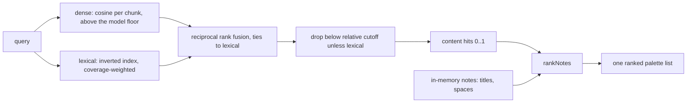

# ADR-010: Hybrid relevance — title-aware indexing, lexical fusion, one ranking

- **Status:** Accepted
- **Date:** 2026-07-21

## Context

Searching `pescado` returned pasta. Two notes titled *Tiradito de pescado* and
*Chermoula para pescado* sat below *Raita de pepino*. Four independent defects
stacked up:

1. **Titles were never indexed.** The title lives only in frontmatter, and
  `parseNote` strips frontmatter before chunking — so a word that appeared
   only in a title was invisible to search.
2. **No lexical signal reached the ranker.** Retrieval was pure dense
  similarity. A one-word Spanish noun carries almost no sentence structure
   for a paraphrase model, which is the worst case for dense-only retrieval.
3. **The palette concatenated two lists** — all semantic hits, then up to five
  lexical title matches — so a literal title match rendered *below* eight
   weak cosines by construction.
4. `**minScore: 0.15` filtered nothing.** Unrelated Spanish recipes routinely
  scored 0.2–0.4, so `topK` was always filled with whatever ranked least
   badly.

## Decision

**Index the title.** Every note gets a title-only vector
(`kind: "title"`, `idx: -1`) *and* has its title prefixed onto every body
chunk before embedding. The first makes a title match score on its own; the
second keeps a chunk about marinating aware of which dish it belongs to. The
content fingerprint now covers `title + body`, so a rename invalidates the
note's vectors. `SEMANTIC_SCHEMA_VERSION` → 2 ([ADR-008](./008-schema-compatibility.md)).

**Chunk at ~120 words / 24 overlap** (was 200/32). A whole recipe as one
vector averages ingredients, method and notes, and is then strongly about
nothing.

**Fuse two retrievers.** `src/domain/search/lexical-index.ts` builds an
in-memory inverted index with BM25-shaped saturation and idf, the title field
weighted ×3, and prefix matching so results appear mid-word. Terms are folded
for case, accents **and Spanish inflection** — a note says "plato
vegetarian*o*" and the query says "receta vegetarian*a*", and without folding
those are simply different words. Number and gender only: `trimestral` and
`trimestre` stay apart, because merging derivations needs a Snowball-class
stemmer and its false merges.

Multi-term queries are scored by **idf-weighted coverage**: a note carrying
every query term outranks one carrying half, weighted so that missing "de"
costs nothing and missing "marruecos" costs most of the score.

That ranking and the dense one are combined by **Reciprocal Rank Fusion** —
positions, not scores, because a cosine and a BM25 weight cannot be added
meaningfully. No dependency; RRF is fifteen lines. Its one sharp edge is that
with two lists exact ties are common, so `fuseRankings` guarantees ties resolve
to the ranking passed *first*, and `searchSemantic` passes the lexical one
first: a note that literally contains what was typed is the better answer to
hand back when fusion cannot separate two candidates.

**Rank once.** `rankNotes` produces the single list the palette renders.
Content relevance comes from the index; title and space signals come from the
caller's in-memory note list, which is current even while the index is still
building — so a title match appears on the first keystroke of a fresh vault.
Bonuses are in the same units as the normalised content score:

| signal                                  | bonus |
| --------------------------------------- | ----- |
| title equals the query                  | 1.2   |
| title starts with the query             | 0.8   |
| title contains the query                | 0.5   |
| every query term appears in the title   | 0.35  |
| the whole query names a space           | +0.2  |
| a space name explains part of the query | +0.1  |

1.2 is above the maximum content score, so an exact title match is
unbeatable — a note called exactly what you typed is the answer, whatever the
vectors think. A substring match at 0.5 is a strong hint, not a veto.

**Make the space name carry concept search.** "africa" returns Moroccan
recipes, an Egyptian trip and an offsite in Marrakech — because the user filed
all of them under *África*, not because a model knows where Marrakech is. This
is the deliberate answer to conceptual queries: deterministic, visible in the
palette as a chip, and it degrades honestly. Notes nobody filed are not found
by concept, and no model quality changes that.

The signal is per term, because the useful shape is mixed: in "receta
vegetariana" one term names a space and the other selects within it. A *whole*
match is reason enough to show a note the index never returned; a *partial*
one only reorders notes that already match on content — otherwise every recipe
in the vault would answer the word "receta".

**Filter relative to the floor, after fusion.** The absolute floor lives on the
embedder ([ADR-003](./003-semantic-search-embeddings.md)) because what counts
as "too weak" is a model property. On top of it, a note must reach 60% of the
best score *measured up from that floor*; measuring from zero is useless for a
model whose scores all land in 0.7–0.9.

The cutoff decides what is worth **showing**, so it is applied to the fused
result, never to the fusion's input. Filtering the dense list first was a real
bug: it did not remove a note from the results (the lexical side still carried
it), it only inflated the fused rank of whatever mediocre note survived in both
lists, and a dominant literal match lost to it. Notes below the cutoff cannot
outrank the ones above them anyway, so leaving them in the ranking is free.
Lexical matches bypass the cutoff entirely: a literal term match has earned its
place. One hit per note, since the palette shows one row per note.

**Show which signal fired.** Recency keeps the clock icon; title and literal
matches get the arrow; vector-only matches and space matches each get their
own. Concatenation hid this: every lexical hit rendered as "something you
opened lately".

**Guard it with fixtures.** `src/test/relevanceFixtures.ts` holds a Spanish
corpus of recipes, trips and a work journal — with spaces cutting across all
three — and query cases covering single terms, multi-term queries, concept
queries and precision guards, asserted end-to-end in
`src/application/__tests__/relevance.test.ts`. Every decision above is a
ranking change; without a regression net they get tuned by feel and silently
undone. Writing that corpus in real Spanish rather than in matching keywords is
what exposed the inflection gap, the coverage gap and the cutoff bug above.

## Consequences

### Positive

- The reported query works, and stays working — the case is a fixture.
- Literal matches are found even when the model has no idea what the word is.
- Short, honest result lists instead of `topK` least-bad neighbours.
- Title and space matches work with no index at all, which also covers the
first run and every keystroke typed while a vault is still indexing.
- Concept search exists without betting on model quality.

### Negative

- Existing vaults re-index once on upgrade (schema bump).
- Renaming a note now costs a re-embed of that note.

The inverted index was first rebuilt per query from the records streamed off
disk. On a synthetic FS that assumption ("cheap next to the file reads") was
wrong: re-tokenising the whole corpus dominated a query and regressed
`searchSemantic` ~10× on every corpus size. The index is now built once and
cached per open vault (`LexicalIndexCache`, held by `fs-semantic-search`), fed
incrementally from the same dense-scoring stream, and dropped whenever the
on-disk index changes (`reindex`, `pruneOrphans`). Dense scoring still streams
every record — the query vector is new each keystroke — but the corpus is
tokenised once per change, not once per keystroke. Prefix expansion is a
binary search over the sorted vocabulary rather than a full scan. Persisting
the index to disk (surviving reload, not just the session) remains available if
the first-query cost after opening a large vault proves to matter.

### Neutral

- The fixtures run against `FakeEmbedder`, so they prove ranking policy, not
model quality. Dense recall has to be measured in a browser against the real
model.

## Diagram

## References

- [ADR-003](./003-semantic-search-embeddings.md) — embeddings, model choice, embedder floor
- [ADR-008](./008-schema-compatibility.md) — schema versioning
- [Reciprocal Rank Fusion (Cormack et al., 2009)](https://plg.uwaterloo.ca/~gvcormac/cormacksigir09-rrf.pdf)
- [BM25 (Robertson & Zaragoza)](https://www.staff.city.ac.uk/~sbrp622/papers/foundations_bm25_review.pdf)
- Code: `src/domain/search/`, `src/infrastructure/search/{indexer,search,chunk}.ts`,
`src/application/view-models.ts`, `src/screens/CommandPalette.tsx`

