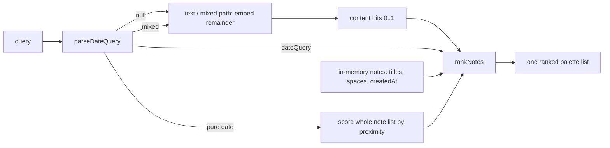

# ADR-011: Date-aware search — a parsed date range as a third ranking signal

- **Status:** Accepted
- **Date:** 2026-07-21

## Context

Typing a date into search — `agosto 2025`, `5 marzo 2026`, `el mes pasado` —
should surface the notes created around then, nearest first. The creation date
already exists as structured metadata in `index.json`; the question was how to
turn it into relevance.

The obvious reading of "fold dates into relevance" is to put the date into the
embedded text. That does not work. An embedding model has no numeric ordering:
`agosto 2025` and `agosto 2024` land in nearly the same place in vector space,
and `5 marzo` and `6 marzo` are indistinguishable. Cosine similarity is a
similarity of *meaning*, not of *magnitude* — it cannot express "closest to". It
would also pollute content relevance, making a note match "marzo" because of its
timestamp rather than its subject.

This builds directly on the single merged ranking from
[ADR-010](./010-hybrid-relevance.md): a third signal is only cheap to add
because there is one list to fuse it into, not two concatenated ones.

## Decision

**Parse the date, score it exactly, fuse it as its own signal.**

**Parse, don't embed.** `src/lib/parse-date-query.ts` reads a date expression
out of the query and returns `{ from, to, granularity, matchedText } | null`.
Month names come from `Intl.DateTimeFormat` for the active locale plus a
permanent English fallback, so `marzo`, `mar`, `March` and `Mar` all resolve
without a hardcoded month list. It handles `2025`, `agosto 2025`, `marzo`,
`5 marzo 2026`, `5 de marzo`, `5/3/2026`, and relative forms (`ayer`,
`la semana pasada`, `el mes pasado`, `hace 3 meses`, and their English
equivalents). Numeric forms are genuinely ambiguous — `5/3` is D/M or M/D — and
are resolved by the locale's field order read from `Intl`, not guessed. No
dependency: `date-fns` is forbidden without an ADR (AGENTS §3) and this is ~100
lines of arithmetic over `Date` and `Intl`.

**Compare in local time.** `createdAt` is a UTC ISO string, so a note created at
23:30 on 4 March local is stored as 5 March UTC. The parser builds its ranges
from local `Date` components and `scoreDateProximity` compares the note's
*instant* against them, so the note stays on 4 March. Naive string-slicing of
the ISO date would put it on the wrong day — the timezone trap has its own
fixture.

**Score by proximity, scaled to granularity.** "Closest" is relative to how
precise the query was: three days off a `day` query is a weak match, but three
days off a `month` query is squarely inside it. A note inside the parsed range
scores `1.0`; outside, the score decays with a half-life tied to the
granularity — days for `day`, weeks for `month`, months for `year`. A decay, not
a hard filter: the user asked for the nearest note, so a month with no notes
must return its neighbours, not an empty list.

**Classify the query into three cases.** The parser's output splits search into
three behaviours, decided in `CommandPalette`:

| query               | behaviour |
| ------------------- | --------- |
| pure date (`agosto 2025`)      | Skip the embedder entirely; rank the whole in-memory note list by proximity. Instant and index-free — it works before a single vector exists. |
| mixed (`pescado agosto 2025`)  | Strip the matched date text, embed the remainder; content decides *which* notes, proximity decides their *order* among comparable matches. |
| no date                        | Unchanged. |

The fusion lives in `rankNotes` ([ADR-010](./010-hybrid-relevance.md)). Pure
date is a dedicated branch that scores every note. Mixed adds a proximity term,
weighted at **0.5** — below the title bonuses on purpose — only to notes the
content stage already surfaced. A date must never conjure a note into the list
nor silently filter a strong content match out: content is still what decides
membership.

**Make the interpretation visible.** A silent reinterpretation of the query is
worse than no feature — the user must be able to tell that "marzo" was read as a
date, not as a word. The palette shows the resolved range as a chip
("August 2026 · by creation date") with its own calendar icon, and the chip can
be dismissed to fall back to plain text search for that query.

**createdAt vs updatedAt, stated.** Search ranks by **creation** date; the note
list and `formatRelative` keep showing **modification** date, as they always
have. Ranking by one while displaying the other is a deliberate product choice,
recorded here so it does not read as a bug. `createdAt` is plumbed through
`NoteSummary` and `NoteListItem` purely so the ranker can reach it without a
disk read.

## Consequences

### Positive

- Date queries answer instantly, with no embedder and no disk read, and work
  while the index is still building.
- A note is ranked by how close its creation date actually is — something no
  amount of embedding the date could achieve.
- The date signal never removes a content match; it only reorders comparable
  ones.
- The interpretation is visible and reversible.

### Negative

- Month-name recognition follows the active locale (plus English). A user whose
  browser locale is neither will not get non-English month names parsed.
- Numeric ambiguity is resolved by locale, so `5/3` means different days for
  different users — correct, but worth knowing.

### Neutral

- Bare months (`marzo`) resolve against the current year; the proximity decay,
  not the parser, is what surfaces the nearest notes.
- The mixed-query weight (0.5) is a tuning constant guarded by the relevance
  fixtures, not a first principle.

## Diagram

## References

- [ADR-010](./010-hybrid-relevance.md) — the single merged ranking this fuses into
- [ADR-003](./003-semantic-search-embeddings.md) — embeddings and the embedder floor
- Code: `src/lib/parse-date-query.ts`, `src/domain/search/rank.ts`,
  `src/application/view-models.ts`, `src/screens/CommandPalette.tsx`
- Fixtures: `src/lib/__tests__/parse-date-query.test.ts`,
  `src/test/relevanceFixtures.ts`, `src/application/__tests__/relevance.test.ts`
