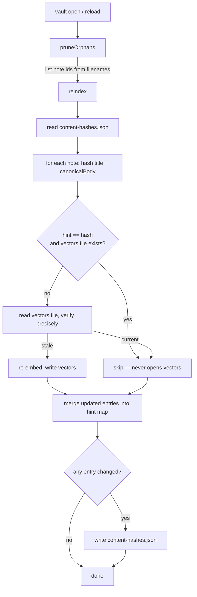

# ADR-011: A content-hash hint so the reindex scan stops reading vectors

- **Status:** Accepted
- **Date:** 2026-07-21
- **Updated:** 2026-07-25

## Context

Every vault open runs `runFullReindex`: `pruneOrphans` then `reindex`. On a
vault where nothing changed, that pass does no embedding — but it was still
`O(vault)` of file I/O, and slow enough to be felt on a reload:

- `reindex` read every note's Markdown to compute a `contentHash`, **and then
  opened and JSON-parsed every note's vectors file** (`readNoteEmbeddings`) just
  to compare that hash. The vectors file is the large one — hundreds of floats
  per chunk — and parsing those arrays is the dominant cost.
- `pruneOrphans` streamed and fully parsed **every** vectors file
  (`iterateNoteEmbeddings`) only to collect the note ids it already encodes in
  the filename.

So the reload cost was two full passes over the heaviest files on disk, for a
result that is almost always "nothing to do". ADR-004 keeps the authoritative
`contentHash` inside each note's JSON, which is correct but forces a full read
to see it.

## Decision

### Hint file

Add `.semantic-index/content-hashes.json`: a compact `noteId → contentHash`
map. It is a **performance sidecar** — the per-note vectors format from ADR-004
is unchanged.

The hint is a **cache, never the source of truth.** Each note's own JSON keeps
its authoritative `contentHash`. A stale or partially-synced hint can only cause
a redundant re-embed, never a wrong skip.

### Up-to-date check

`reindex` loads the hint map once, then for each note:

1. Compute a fresh `contentHash` from the note title and `canonicalBody(body)`
   (see below).
2. **Fast path:** if the hint for that note equals the fresh hash **and** the
   vectors file still exists (a cheap existence check, no read), skip the note
   without opening its vectors.
3. **Fallback:** read the vectors file and run the precise check from ADR-004
   (hash, model, schema). Re-embed when stale; skip when already current.

The fallback also runs on first open after upgrade, when no hint file exists
yet — that pass repopulates the hints for later scans.

### Maintaining the map

`reindex` is called both for the full vault on open (ADR-007) and for a **single
note** after autosave. The hint map must behave correctly in both cases:

- **Merge on read:** start from the map already on disk, then update entries
  for the notes in this call. Other notes keep their entries untouched.
- **Write on change:** persist the file only when at least one entry moved.
  A no-op scan or an autosave tick that finds nothing to do must not rewrite
  the whole vault-wide file.
- **Write last:** flush hints after the per-note vectors files are written, so
  a lost hint write only costs a slower next scan, not inconsistent vectors.
- **Prune on delete:** `pruneOrphans` drops entries for note ids it removes.
  It is the only caller that knows the full set of live notes.
- **Wipe with the index:** `clearSemanticIndex` (model/schema change, ADR-008)
  deletes the hint file along with the vectors, so hints never point at files
  that no longer exist.

### Content fingerprint

The hash is taken over `canonicalBody` (`src/domain/note/frontmatter.ts`) — the
body as it will read back off disk after `serializeNote` / `parseNote`
normalisation (CRLF folding, trailing whitespace, blank lines after the
frontmatter delimiter).

Incremental reindex receives the editor's in-memory text; the full reindex
holds the parsed file. Without a shared canonical form, those two strings can
differ while the note content is unchanged, and the up-to-date check would
disagree with itself. Both callers hash the same canonical body.

### Orphan detection

`pruneOrphans` lists `.semantic-index/notes/` by filename instead of parsing
files. The filename *is* the note id (`<noteId>.json`), so orphan detection
needs no reads at all.

## Consequences

### Positive

- A no-op reload scan no longer opens or parses a single vectors file: it reads
  the note bodies (small), the one hint file, and directory listings. The
  `O(vault)` cost that was felt on reload drops to hashing prose.
- Incremental reindex after autosave updates one hint entry without disturbing
  the rest of the vault.
- `pruneOrphans` is name-only, so it also catches a corrupt vectors file that
  a parse-based scan would silently skip and leak.

### Negative

- One more file under `.semantic-index/`, and a *wide* one — it changes whenever
  any note is re-embedded, unlike ADR-004's one-file-per-note layout. It is
  small, and because it is a self-healing hint a lost or conflicting sync of it
  only costs a redundant re-embed, so the narrow-conflict property that matters
  is preserved in effect.
- A vectors file that is corrupt-but-present is no longer re-embedded by the
  scan (the existence guard only checks presence, not integrity). Search
  already tolerates a corrupt file by skipping it, and a content edit or an
  index wipe re-embeds it; the alternative — parsing every file to detect
  corruption — is exactly the cost this ADR removes.

### Neutral

- A per-note `meta.json` sidecar (tiny, narrow-sync) was considered as the
  alternative to one wide hint file. It keeps ADR-004's conflict property
  exactly but reintroduces `O(vault)` file opens on the scan (just of small
  files) and doubles the inode count. The single hint file trades that for one
  read, accepting the self-healing wide-file tradeoff above.

## Diagram

## References

- [ADR-004](./004-semantic-index-persistence.md) — index layout, per-note files, `contentHash`
- [ADR-007](./007-autosave-eventual-reindex.md) — when reindex runs (full vault vs single note)
- [ADR-008](./008-schema-compatibility.md) — schema/model invalidation and wipe
- Code: `src/infrastructure/search/{indexer,index-fs,types}.ts`,
  `src/domain/note/frontmatter.ts` (`canonicalBody`),
  `src/infrastructure/search/__benchmarks__/indexer.bench.ts`
