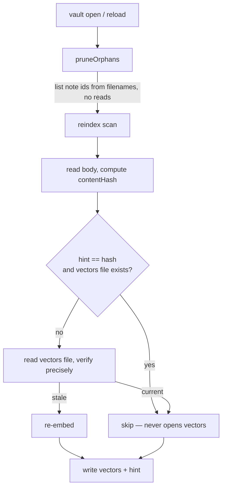

# ADR-011: A content-hash hint so the reindex scan stops reading vectors

- **Status:** Accepted
- **Date:** 2026-07-21

## Context

Every vault open runs `runFullReindex`: `pruneOrphans` then `reindex`. On a
vault where nothing changed, that pass does no embedding — but it was still
`O(vault)` of file I/O, and slow enough to be felt on a reload:

- `reindex` read, parsed and hashed every note's Markdown to compute a
  `contentHash`, **and then opened and JSON-parsed every note's vectors file**
  (`readNoteEmbeddings`) just to compare that hash. The vectors file is the
  large one — hundreds of floats per chunk — and parsing those arrays is the
  dominant cost.
- `pruneOrphans` streamed and fully parsed **every** vectors file
  (`iterateNoteEmbeddings`) only to collect the note ids it already encodes in
  the filename.

So the reload cost was two full passes over the heaviest files on disk, for a
result that is almost always "nothing to do". ADR-004 keeps the authoritative
`contentHash` inside each note's JSON, which is correct but forces a full read
to see it.

## Decision

**Write a hint file: `.semantic-index/content-hashes.json`**, a compact
`noteId → contentHash` map, rebuilt at the end of every `reindex` from the live
notes.

`reindex`'s up-to-date check gains a fast path: if the hint for a note equals
the freshly computed `contentHash` **and** the note's vectors file still exists
(a cheap existence check, no read), the note is skipped without ever opening
its vectors. Only when the hint is missing, stale, or the file has vanished
does it fall back to the precise check that reads the vectors file — which is
also the first run after upgrade, where the pass repopulates the hints.

**The hint is a cache, never the source of truth.** Each note's own JSON keeps
its authoritative `contentHash`; the fast path is only ever taken when the hint
agrees with a hash computed *now* from the note body. So a stale or
partially-synced hint can only cause a redundant re-embed, not a wrong skip.
The hint is written *after* the vectors files, and dropped by
`clearSemanticIndex` (model/schema change) so a wipe cannot leave hints
pointing at vectors that no longer exist.

**`pruneOrphans` lists directory names instead of parsing files.** The filename
*is* the note id (`<noteId>.json`), so orphan detection needs no reads at all;
it also drops the pruned ids from the hint map.

The per-note on-disk format (ADR-004) is unchanged: the hint file is a new,
separate performance sidecar.

## Consequences

### Positive

- A no-op reload scan no longer opens or parses a single vectors file: it reads
  the note bodies (small), the one hint file, and directory listings. The
  `O(vault)` cost that was felt on reload drops to hashing prose.
- `pruneOrphans` is name-only, so it also catches a corrupt vectors file that a
  parse-based scan would silently skip and leak.

### Negative

- One more file under `.semantic-index/`, and a *wide* one — it changes whenever
  any note is re-embedded, unlike ADR-004's one-file-per-note layout. It is
  small, and because it is a self-healing hint a lost or conflicting sync of it
  only costs a redundant re-embed, so the narrow-conflict property that matters
  is preserved in effect.
- A vectors file that is corrupt-but-present is no longer re-embedded by the
  scan (the existence guard only checks presence, not integrity). Search
  already tolerates a corrupt file by skipping it, and a content edit or an
  index wipe re-embeds it; the alternative — parsing every file to detect
  corruption — is exactly the cost this ADR removes.

### Neutral

- A per-note `meta.json` sidecar (tiny, narrow-sync) was considered as the
  alternative to one wide hint file. It keeps ADR-004's conflict property
  exactly but reintroduces `O(vault)` file opens on the scan (just of small
  files) and doubles the inode count. The single hint file trades that for one
  read, accepting the self-healing wide-file tradeoff above.

## Diagram

## References

- [ADR-004](./004-semantic-index-persistence.md) — index layout, per-note files, `contentHash`
- [ADR-007](./007-autosave-eventual-reindex.md) — when reindex runs
- [ADR-008](./008-schema-compatibility.md) — schema/model invalidation and wipe
- Code: `src/infrastructure/search/{indexer,index-fs,types}.ts`,
  `src/infrastructure/search/__benchmarks__/indexer.bench.ts`
