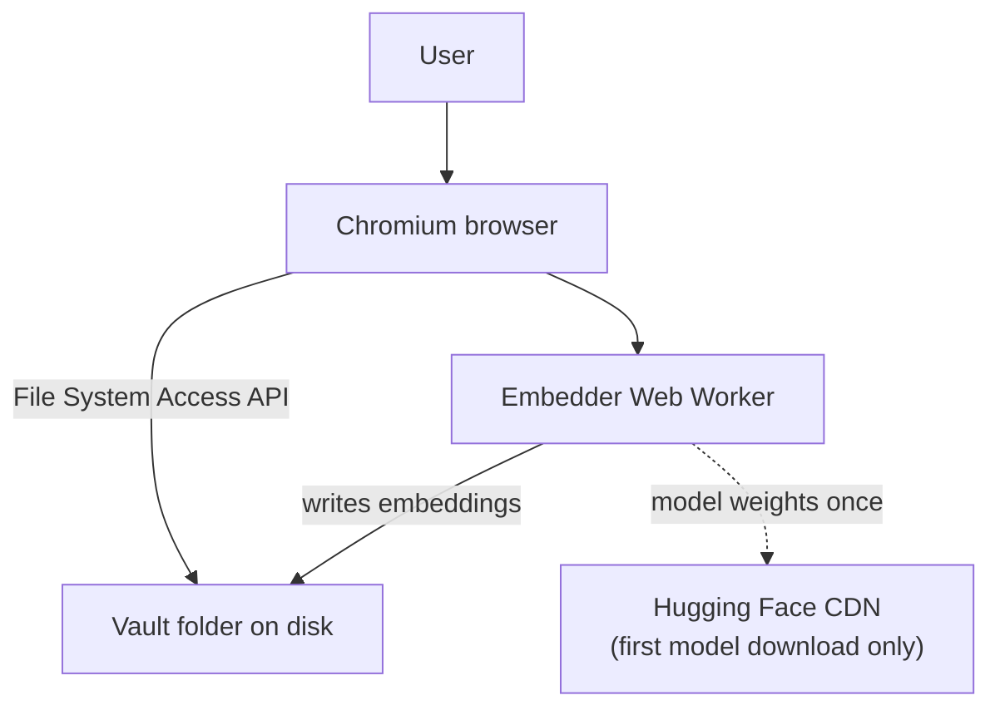
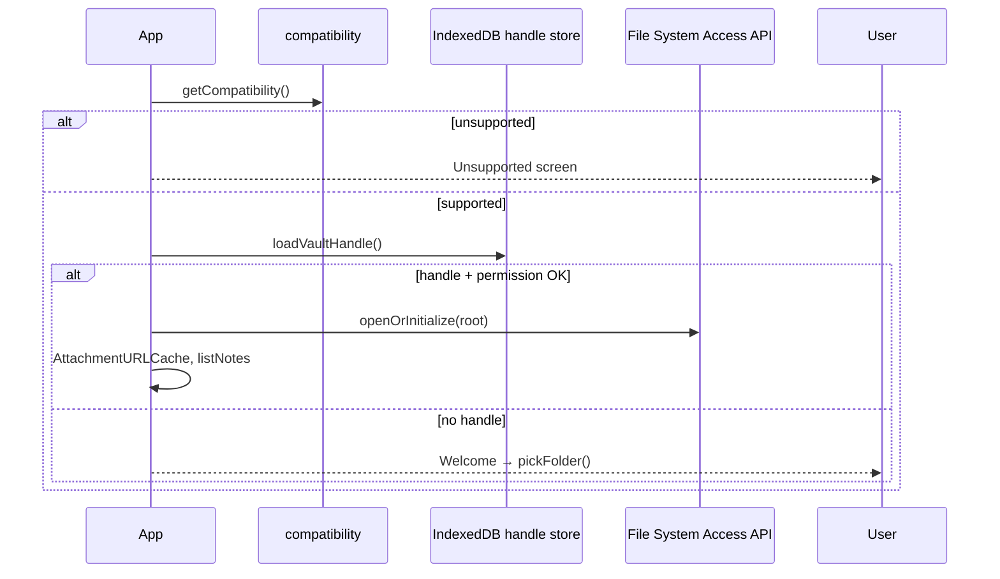
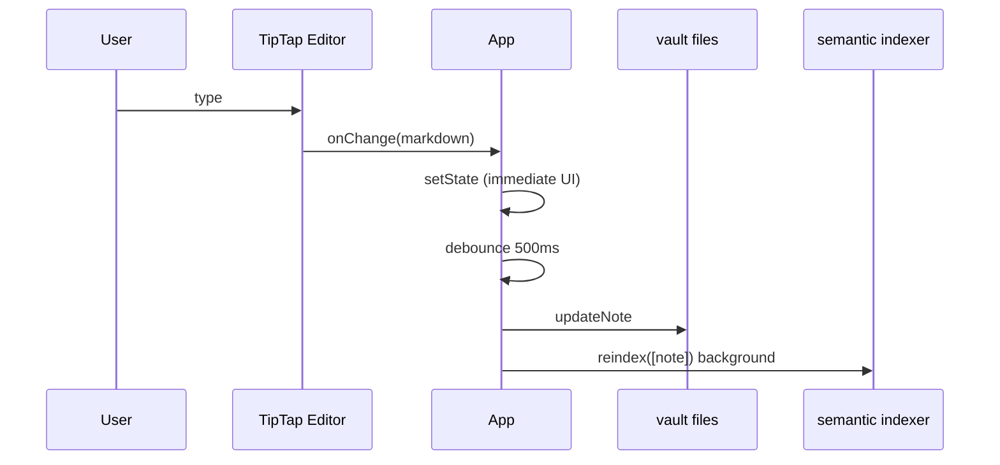

# System architecture

High-level map of **private-notes**: a browser app that reads and writes a folder on disk, edits Markdown notes, and runs semantic search locally.

For **why** each choice was made, see the linked ADRs in [docs/README.md](./README.md).

## Context diagram



**Privacy:** note content and attachments never leave the device except the optional one-time download of the embedding model.

## On-disk layout (summary)

```
<vault>/
  .private-notes/          # app metadata (ADR-002, ADR-008)
    manifest.json
    index.json
  .semantic-index/         # vector index (ADR-004)
    manifest.json
    notes/<noteId>.json
  notes/YYYY/MM/          # Markdown + YAML frontmatter
  attachments/<noteId>/   # content-addressed files (ADR-006)
```

Details: [ADR-002](./adr/002-note-storage-format.md), [ADR-004](./adr/004-semantic-index-persistence.md).

## Schema versions

| Store | Constant | File | On mismatch |
|-------|----------|------|-------------|
| Vault | `SCHEMA_VERSION` | `.private-notes/manifest.json` | Refuse open if newer than app ([ADR-008](./adr/008-schema-compatibility.md)) |
| Semantic index | `SEMANTIC_SCHEMA_VERSION` | `.semantic-index/manifest.json` | Wipe index and re-embed |

## Module map

| Concern | Source | ADR |
|---------|--------|-----|
| Boot, vault open, picker | `src/lib/fs/`, `src/App.tsx` | [001](./adr/001-local-first-vault.md) |
| Note CRUD, frontmatter | `src/lib/notes/` | [002](./adr/002-note-storage-format.md) |
| Embedder, chunking, worker | `src/lib/search/`, `src/workers/` | [003](./adr/003-semantic-search-embeddings.md) |
| Index I/O, search, reindex | `src/lib/search/` | [004](./adr/004-semantic-index-persistence.md) |
| Editor UI | `src/editor/` | [005](./adr/005-markdown-editor.md) |
| MD parse/serialize | `src/lib/markdown/` | [005](./adr/005-markdown-editor.md) |
| Attachments + cache | `src/lib/attachments/` | [006](./adr/006-attachments-cache.md) |
| Autosave, orchestration | `src/App.tsx` | [007](./adr/007-autosave-eventual-reindex.md) |
| Command palette search | `src/screens/CommandPalette.tsx` | [003](./adr/003-semantic-search-embeddings.md), [004](./adr/004-semantic-index-persistence.md) |
| Browser gate | `src/lib/compatibility.ts` | [001](./adr/001-local-first-vault.md), [008](./adr/008-schema-compatibility.md) |

## Flow: open vault



See [ADR-001](./adr/001-local-first-vault.md).

## Flow: edit and save



See [ADR-005](./adr/005-markdown-editor.md), [ADR-007](./adr/007-autosave-eventual-reindex.md).

## Flow: semantic search


- **Indexing:** chunk body → embed batches → write `.semantic-index/notes/<id>.json`.
- **Invalidation:** `contentHash`, schema version, model id/dimensions ([ADR-004](./adr/004-semantic-index-persistence.md)).

## Flow: full reindex

Triggered when the vault opens (embedder ready) or manually from Search panel:

1. `pruneOrphans` — remove embedding files for deleted notes.
2. `reindex` — for each note, skip if `contentHash` and metadata still match; else re-embed.

Incremental reindex on save only processes the saved note ([ADR-007](./adr/007-autosave-eventual-reindex.md)).

## Command palette

`CommandPalette` combines:

- **Semantic hits** when the embedder is ready and the query is non-empty.
- **Lexical fallback** — title substring match on the note list when semantic search returns nothing useful.

## Code splitting

Heavy pieces load after vault open to keep the initial bundle small:

- `Editor` — `React.lazy` in `App.tsx`
- Search API — `loadSearchApi()` in `src/lib/search/runtime.ts`
- Embedding model — Web Worker + transformers.js ([ADR-003](./adr/003-semantic-search-embeddings.md))

## Testing hooks

| Component | Test double |
|-----------|-------------|
| File system | `src/test/fakeFs.ts` |
| Embedder | `FakeEmbedder` in `src/lib/search/embedder.ts` |

## Related documents

- [ADR index](./README.md)
- [User README](../README.md)
