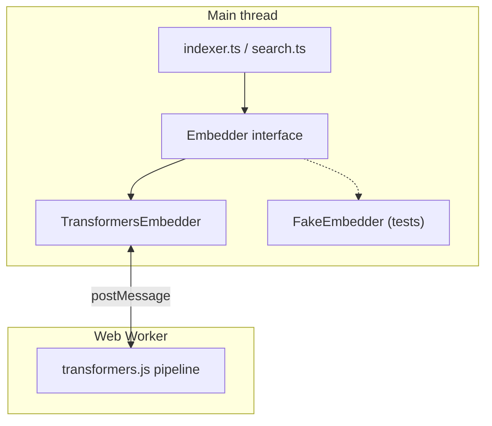

# Semantic search primer

Optional deep dive for contributors who want to understand **how** embeddings and
vector search work in this app. For **why** we chose this approach, see
[ADR-003](./adr/003-semantic-search-embeddings.md) and
[ADR-004](./adr/004-semantic-index-persistence.md). For system flows, see
[architecture.md](./architecture.md).

## Three layers



| Layer | File | Thread | Role |
|-------|------|--------|------|
| **`Embedder`** | `embedder.ts` | Main | Contract (`id`, `dimensions`, `embed`). Also `dot()` and `FakeEmbedder` for tests. |
| **`TransformersEmbedder`** | `transformers-embedder.ts` | Main | Worker client: lifecycle, message IDs, Promises. No ML here. |
| **Worker** | `embedder.worker.ts` | Worker | Loads the model, runs `feature-extraction`, returns vectors. |

`indexer.ts` and `search.ts` depend only on the **`Embedder` interface**. They do
not import transformers.js or `Worker`. Production injects `TransformersEmbedder`;
tests inject `FakeEmbedder`.

## What runs where

Only **model inference** belongs in the worker. Everything else stays on the main
thread because it is cheap or needs File System Access API handles.

| Step | Location | Why |
|------|----------|-----|
| Read/write vault files | Main | FSA handles live in `App.tsx` |
| `chunkText()` | Main | Synchronous, no tokenizer dependency |
| `embedder.embed(batch)` | Worker (via client) | Heavy CPU; would freeze the UI |
| Write `.semantic-index/*.json` | Main | Same FSA reason |
| `dot(query, chunk)` scoring | Main | O(dimensions) per chunk; far cheaper than inference |

## End-to-end: index a note

1. **Main** — `reindex` reads the Markdown body, checks `contentHash`, skips if fresh.
2. **Main** — `chunkText` splits the body (~200 words, ~32 overlap).
3. **Main** — batches of 16 chunk texts call `embedder.embed(batch)`.
4. **Main → Worker** — `TransformersEmbedder` sends `{ type: "embed", texts }`.
5. **Worker** — runs the pipeline, posts back L2-normalized vectors.
6. **Main** — writes `.semantic-index/notes/<noteId>.json`.

## End-to-end: search

1. **Main** — `searchSemantic` calls `embedder.embed([query])` once.
2. **Worker** — returns the query vector.
3. **Main** — streams each per-note JSON file, computes `dot(query, chunk.embedding)`.
4. **Main** — keeps top chunks per note, then global top-K.

Stored note vectors are **not** re-embedded on every search — only the query is.

## Cosine similarity

Cosine similarity measures how aligned two vectors are (angle, not length):

\[
\text{cosine}(A, B) = \frac{A \cdot B}{\|A\| \times \|B\|}
\]

The worker sets `normalize: true`, so every vector has unit length (\(\|A\| = 1\)).
Then cosine reduces to a **dot product**:

\[
\text{cosine}(A, B) = A \cdot B = \sum_i A_i B_i
\]

That is why `search.ts` calls `dot()` from `embedder.ts` and
[ADR-004](./adr/004-semantic-index-persistence.md) states “cosine = dot product.”

Typical scores for normalized sentence embeddings fall roughly in \([0, 1]\) for
related text; the app filters with `minScore` (default 0.15 in `App.tsx`).

## Feature extraction, pooling, normalize

The worker uses transformers.js:

```typescript
pipeline("feature-extraction", modelId, { device: "wasm" });
// ...
extractor(texts, { pooling: "mean", normalize: true });
```

**Feature extraction** — a sentence-transformer model (MiniLM) turns each input
string into a fixed-size vector (384 dimensions for the default model).

Internally:

1. Tokenize the text.
2. Run the transformer (many matrix multiplications across layers).
3. **Pool** token vectors into one vector per input string.
4. **Normalize** to unit length.

**Mean pooling** averages the hidden state across all tokens. It captures the
whole chunk, not just the first or last token. Alternatives like CLS-only pooling
exist but are not used here.

**Normalize** divides by the L2 norm so search can use dot products as cosine
similarity without recomputing norms at query time.

The `init` probe (`embed(["a"])`) discovers `dimensions` at runtime so
`TransformersEmbedder.dimensions` matches the loaded model.

## Matrix multiplication (high level)

Neural inference is dominated by **matrix multiplication** (matmul): rows of one
matrix dotted with columns of another. Each transformer layer applies matmuls for
attention and feed-forward blocks.

For this app:

- **Indexing / query embed** — matmul-heavy; runs in the worker.
- **Search over stored chunks** — one dot product per chunk (384 multiplies +
  adds); runs on the main thread and stays fast for personal vault sizes.

That cost asymmetry is why we persist embeddings to disk and only re-embed when
content or model changes ([ADR-004](./adr/004-semantic-index-persistence.md)).

## Further reading

- [ADR-003: Embeddings & embedder](./adr/003-semantic-search-embeddings.md)
- [ADR-004: Index layout & search](./adr/004-semantic-index-persistence.md)
- [Getting started with embeddings (Hugging Face)](https://huggingface.co/blog/getting-started-with-embeddings)
- [Cosine similarity (Wikipedia)](https://en.wikipedia.org/wiki/Cosine_similarity)
- [transformers.js docs](https://huggingface.co/docs/transformers.js)
- Code: `src/lib/search/embedder.ts`, `transformers-embedder.ts`, `indexer.ts`,
  `search.ts`, `src/workers/embedder.worker.ts`
